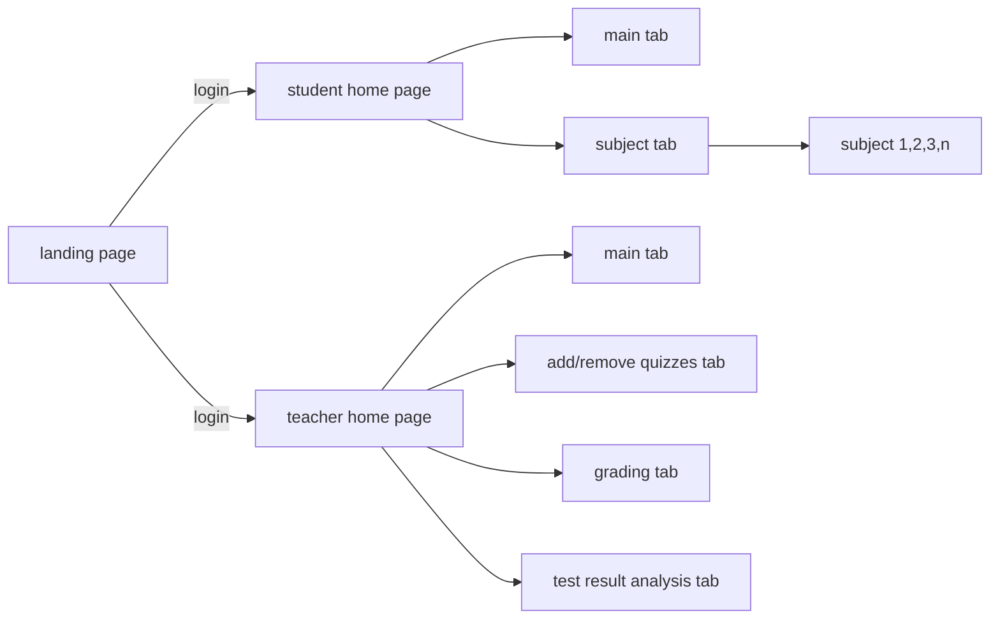

# Meeting 150420

## Github
github project repo created and everyone joined
will upload meeting hour as md file in the repo

## Idea

**Initial flow design**

**Pages**

- home/landing page
login, explain how the quizzes work etc.

depends on what account they log in, redirect the user to either student home page or teacher home page, either of them has 4 tabs to navigate through

**Student's tabs**

- main
display completed task, mark, date completed etc.
- subjects
available quizzes to do categorised into separate subjects
 
 when student complete the quiz, redirect back to the main tab, update the status of the quiz to display the auto-mark grade or display as pending teacher action
 
 (?) make a place to look at all the scores for one subject

**Teacher's tabs**

- main
- add&remove
when adding quiz, provide feature to choose subject
- grading
manual marking for the quiz that label as short answer
- result
use dropdown to select what measure to use for constructing analytical graph

**Quizzes format**

will create both MCQ and short answer template, decide not to mix both in one quiz sheet

**Account**
- student account
- teacher account

need to sort out how account work

**Database**

seems like we are good to choose whatever suitable for the app, or choose some modules that work well with flask

## Todos

 - [ ] sketch page draft
 - [ ] start making front end
 - [ ] decide style and design
 - [ ] look into flask and DB and authentication maybe

